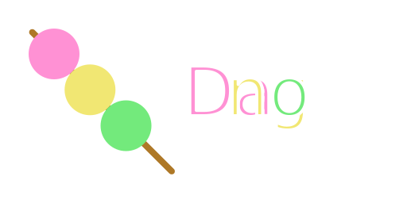

.. Dango documentation master file, created by
   sphinx-quickstart on Wed Oct 29 19:50:02 2025.
   You can adapt this file completely to your liking, but it should at least
   contain the root `toctree` directive.

Dango
=====

.. centered:: Powering applications with `delicious rice-based dumplings held together by a skewer <https://en.wikipedia.org/wiki/Dango>`__.

.. centered:: Website (you are here) | `GitHub <https://github.com/raiseAfloppaFan3925/dango-esolang>`__

.. warning::

   Dango is still in development. Despite being near-stable, there are still MANY features missing from Dango.

Dango is an esoteric programming language that uses `delicious rice-based dumplings held together by skewers <https://en.wikipedia.org/wiki/Dango>`__.

.. code-block:: text
   :caption: "Hello, world!"

   eat (')(Hello, world!)----

.. toctree::
   :maxdepth: 2
   :caption: Contents:

   installation
   getting_started/index

   about
